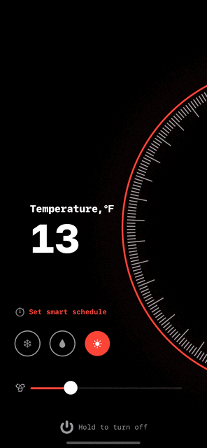
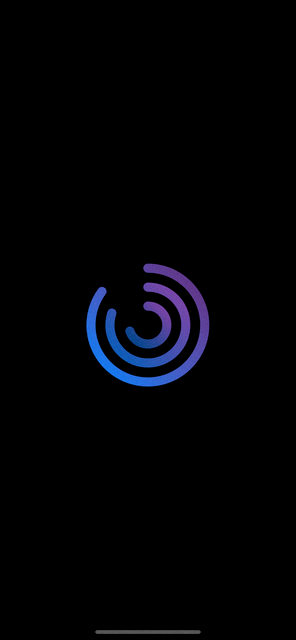

# Animation with SwiftUI

>
```swift 
if let animation = fascinatingAnimation {
    add(animation)
}
```
>


<br>

## Books Solutions 


#### **Book: SwiftUI Animation Quick Start** 

Solutions of challenges.

[ 🔨 Source code](./BookSolutions_QuickStart/)


**Author**

[*SwiftUI Animation Quick Start*](https://www.bigmountainstudio.com/courses/swiftui-animations-free) by *Mark Moeykens*, Big Montains Studio


<br>

## Projects by Tutorials
<br>

#### **Temperature Control UI** 
[ 🔨 Source code](./TemperatureControl/)




>
> Author of the tutorial: [Kazi Munshimun Nabi](https://www.youtube.com/watch?v=yiQjoFTXR8o)
>  
> Design by [Shakuro](https://dribbble.com/shots/5534531-Smart-Home-App-Thermostat)
>

<br>

#### **Fund Transfer** 
[ 🔨 Source code](./FundTransfer/)


>
> Author of the tutorial: [Kazi Munshimun Nabi](https://www.youtube.com/watch?v=Z08rqEN3jRI)
>  
> Design by [Brandi](https://dribbble.com/shots/14092869-Blue)
>

<br>

#### **Circular Chart** 
[ 🔨 Source code](./CircularChart/)

```swift
        Circle()
            .trim(from: showAnimation ? (1 - value) : 0.99, to: 1)
            .stroke(linearGradient, style: StrokeStyle(lineWidth: 12, lineCap: .round))
            .rotationEffect(.degrees(90))
            .rotation3DEffect(
                Angle(degrees: 180),
                axis: (x: 1, y: 0, z: 0))
            .frame(width: width, height: width)
            .animation(.easeOut(duration: 0.7))
            .onTapGesture {
                showAnimation.toggle()
            }
```



>
> Based on tutorial from [DesignCode](https://www.youtube.com/watch?v=6PFYMUL8uQY)
>